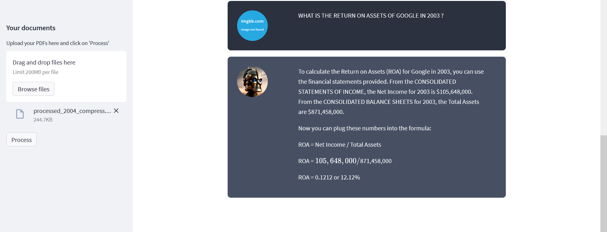
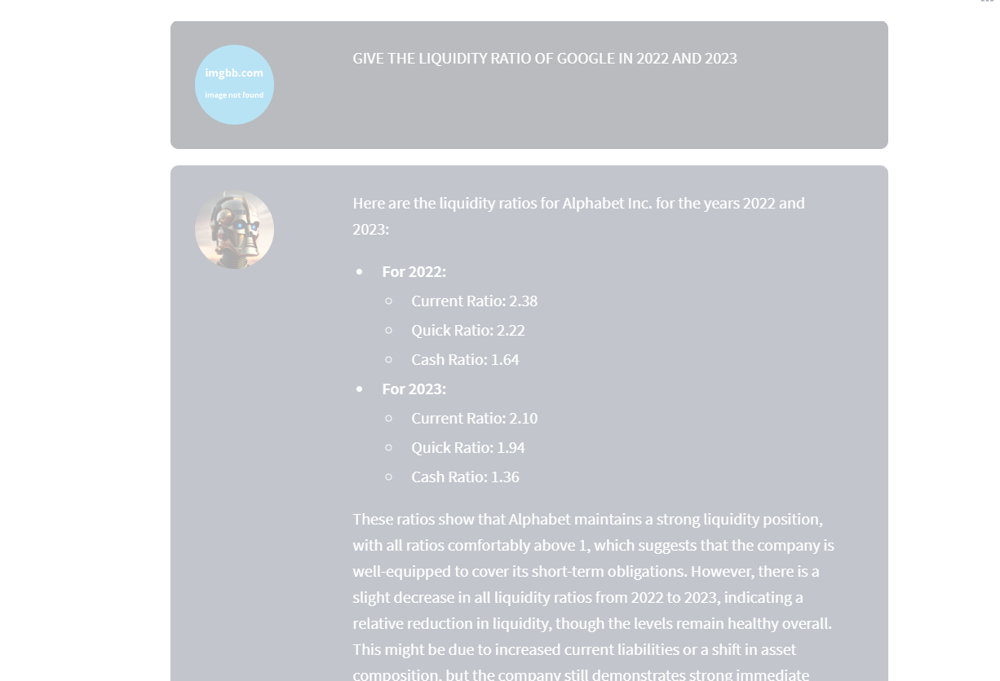
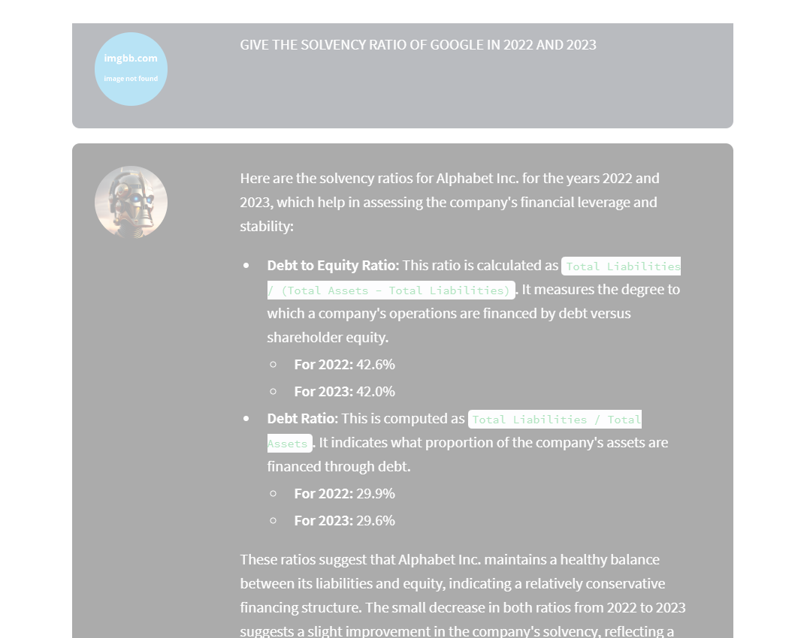
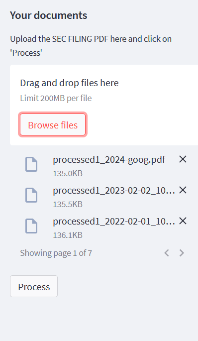

# SEC Filings Chat App

<div style="display: flex; justify-content: space-around; align-items: center; flex-wrap: wrap;">
  
  
  
  
</div>
CHECKOUT THE DOCS FOLDER FOR ALL IMAGE DEMOS

# FinRAG: SEC Filings Analyzer

## Introduction
------------
FinRAG (Financial Retrieval-Augmented Generation) is a Python application designed for analyzing SEC filings. It allows users to interact with the data from SEC filings using natural language queries. This application leverages a language model to generate contextually relevant answers based on the content of the documents. This tool is particularly useful for financial analysts and investors who need to extract and analyze information from complex financial documents quickly.

## How It Works
------------


The application follows these steps to analyze SEC filings and provide responses:

1. **SEC Filings Loading**: Automatically download and process SEC filings using the `sec.py` script.
2. **Document Processing**: Use the `sim.py` script to simulate the extraction and initial processing of the filings.
3. **Text Chunking**: The processed text is divided into manageable chunks that are more effectively analyzed.
4. **Language Model Integration**: Utilizes a language model to generate vector representations (embeddings) of the text chunks.
5. **Contextual Query Handling**: Enhances the retrieval system to consider the context of being a financial analyst, ensuring the responses are highly relevant.
6. **Similarity Matching**: Compares user queries with document chunks to find the most relevant information.
7. **Response Generation**: Generates responses based on the most relevant chunks, providing insights directly derived from the SEC filings.

## Dependencies and Installation
----------------------------
To get started with FinRAG, please follow these installation steps:

1. Clone the repository to your local machine:

   ```
   git clone https://github.com/yourusername/FinRAG.git
   ```

2. Navigate to the cloned directory and install the required dependencies:

   ```
   cd FinRAG
   pip install -r requirements.txt
   ```

3. Set up your environment variables by adding your necessary API key to the `.env` file:

   ```plaintext
   HUGGING_FACEHUB= your_secret_api_key
   OPENAI_API_KEY=your_secret_api_key
   API_KEY= api_key_for_sec-api
   ```

## Usage
-----
To use the FinRAG app, execute the following steps:
1. Run sec.py to download necessary filings ( add the required company ticker)
 ```
   python sec.py
   ```
2. Run sim.py for processing those sec filings
 ```
   python sim.py
   ```
1. Start the application by running `app.py` with Streamlit:

   ```
   streamlit run app.py
   ```

2. The application will launch in your default web browser.

3. Use the interface to upload SEC filings and input your queries about the financial data.

4. The system will process your questions and provide answers directly related to the content of the SEC filings.

## Contributing
------------
FinRAG is intended for educational and professional use in financial analysis. While it is a fully functional tool, enhancements and suggestions are welcome to improve its capabilities.

## License
-------
FinRAG is released under the [MIT License](https://opensource.org/licenses/MIT).
```

This README provides a clear overview of what your application does, how it works, and how to get it running. The contributing and licensing sections define the openness of your project for future enhancements by others, reflecting a typical open-source project on GitHub.

## Introduction
------------
The MultiPDF Chat App is a Python application that allows you to chat with multiple PDF documents. You can ask questions about the PDFs using natural language, and the application will provide relevant responses based on the content of the documents. This app utilizes a language model to generate accurate answers to your queries. Please note that the app will only respond to questions related to the loaded PDFs.

## How It Works
------------


The application follows these steps to provide responses to your questions:

1. PDF Loading: The app reads multiple PDF documents and extracts their text content.

2. Text Chunking: The extracted text is divided into smaller chunks that can be processed effectively.

3. Language Model: The application utilizes a language model to generate vector representations (embeddings) of the text chunks.

4. Similarity Matching: When you ask a question, the app compares it with the text chunks and identifies the most semantically similar ones.

5. Response Generation: The selected chunks are passed to the language model, which generates a response based on the relevant content of the PDFs.

## Dependencies and Installation
----------------------------
To install the MultiPDF Chat App, please follow these steps:

1. Clone the repository to your local machine.

2. Install the required dependencies by running the following command:
   ```
   pip install -r requirements.txt
   ```

3. Obtain an API key from OpenAI and add it to the `.env` file in the project directory.
```commandline
OPENAI_API_KEY=your_secrit_api_key
```

## Usage
-----
To use the MultiPDF Chat App, follow these steps:

1. Ensure that you have installed the required dependencies and added the OpenAI API key to the `.env` file.

2. Run the `app.py` file using the Streamlit CLI. Execute the following command:
   ```
   streamlit run app.py
   ```

3. The application will launch in your default web browser, displaying the user interface.

4. Load multiple PDF documents into the app by following the provided instructions.

5. Ask questions in natural language about the loaded PDFs using the chat interface.

## Contributing
------------
This repository is intended for educational purposes and does not accept further contributions. It serves as supporting material for a YouTube tutorial that demonstrates how to build this project. Feel free to utilize and enhance the app based on your own requirements.

## License
-------
The finRag Chat App is released under the [MIT License](https://opensource.org/licenses/MIT).
