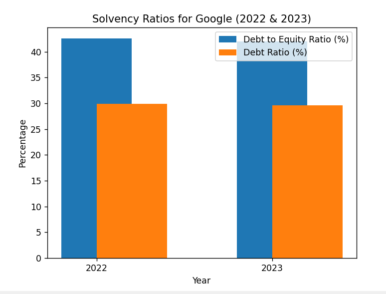

# SEC Filings Chat App

<div style="display: flex; justify-content: space-around; align-items: center; flex-wrap: wrap;">
<h3>The overall view of the app</h3>
  
 <h3>Few answers generated</h3> 
  
  
    <h3>Upload all filings documents</h3>
  
  <h3>Visuals generated from the processed data</h3>
    
    <h3> How it helps the user? </h3>
    <p> 
This application significantly enhances financial analysis by enabling interactive querying of financial data, which allows users to extract specific information efficiently.<br> It automates the calculation of key financial ratios such as profitability, liquidity, and solvency, facilitating quicker and more accurate financial assessments. <br>The integration of visualization tools aids in the clear representation of complex data, making it easier to interpret trends and anomalies. Overall, this system streamlines the analysis process, making it more accessible and insightful for financial analysts.</p>
</div>

CHECKOUT THE DOCS FOLDER FOR ALL IMAGE DEMOS

# FinRAG: SEC Filings Analyzer

## Introduction
------------
FinRAG (Financial Retrieval-Augmented Generation) is a Python application designed for analyzing SEC filings. It allows users to interact with the data from SEC filings using natural language queries. This application leverages a language model to generate contextually relevant answers based on the content of the documents. This tool is particularly useful for financial analysts and investors who need to extract and analyze information from complex financial documents quickly.

## How It Works
------------


The application follows these steps to analyze SEC filings and provide responses:

1. **SEC Filings Loading**: Automatically download and process SEC filings using the `sec.py` script.
2. **Document Processing**: Use the `sim.py` script to simulate the extraction and initial processing of the filings.
3. **Text Chunking**: The processed text is divided into manageable chunks that are more effectively analyzed.
4. **Language Model Integration**: Utilizes a language model to generate vector representations (embeddings) of the text chunks.
5. **Contextual Query Handling**: Enhances the retrieval system to consider the context of being a financial analyst, ensuring the responses are highly relevant.
6. **Similarity Matching**: Compares user queries with document chunks to find the most relevant information.
7. **Response Generation**: Generates responses based on the most relevant chunks, providing insights directly derived from the SEC filings.

## Dependencies and Installation
----------------------------
To get started with FinRAG, please follow these installation steps:

1. Clone the repository to your local machine:

   ```
   git clone https://github.com/Shreyaar12/Fin-Rag/
   ```

2. Navigate to the cloned directory and install the required dependencies:

   ```
   cd Fin-RAG
   pip install -r requirements.txt
   ```

3. Set up your environment variables by adding your necessary API key to the `.env` file:

   ```plaintext
   HUGGING_FACEHUB= your_secret_api_key
   OPENAI_API_KEY=your_secret_api_key
   API_KEY= api_key_for_sec-api
   ```

## Usage
-----
To use the FinRAG app, execute the following steps:
1. Run sec.py to download necessary filings ( add the required company ticker)
 ```
   python sec.py
   ```
2. Run sim.py for processing those sec filings
 ```
   python sim.py
   ```
3. Start the application by running `app.py` with Streamlit:

   ```
   streamlit run app.py
   ```

4. The application will launch in your default web browser.

5. Use the interface to upload SEC filings and input your queries about the financial data.

6. The system will process your questions and provide answers directly related to the content of the SEC filings.
7. Use the insight and run visual.py to generate the necessary graphical visualization

## Technology Stack
------------

- **Python**
- **Streamlit**
- **LangChain**
- **PyPDF2**
- **FAISS (Facebook AI Similarity Search)**
- **dotenv**
- **OpenAI API**
- **Matplotlib**

  
## Contributing
------------
FinRAG is intended for educational and professional use in financial analysis. While it is a fully functional tool, enhancements and suggestions are welcome to improve its capabilities.

## License
-------
FinRAG is released under the [MIT License](https://opensource.org/licenses/MIT).
```


